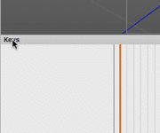

Collada Animations Exporter for Cheetah 3D
==========================================

This script for [Cheetah 3D](https://www.cheetah3d.com/) allows export of all scene animations into a **single Collada file**.

This file can be imported into compatible game engine, like [Godot Engine 3](https://godotengine.org/).


Installation
------------

Move `Export All Animations.js` to Cheetah plugins folder:

```
~/Library/Application Support/Cheetah3D/Scripts/Macro

```

then restart Cheetah3D app.


Usage
-----

Select `Tools > Script > Macro Script > Export All Animations` to export all animations into a single Collada file.


To get more details when exporting, right-click on any panel header and select **Console**:




Note
----

Animations are exported into `library_animation_clips` property, only supported since [Collada v1.4](https://www.collada.org/2005/11/COLLADASchema/).

*Cheetah 3D (7.2) and Preview app (tested on 9.0, bundled with macOS 10.12) don't support it yet.*


=====

Version: 1.0
Author: Lisacintosh, 2018

Script code and example are in Public domain.
